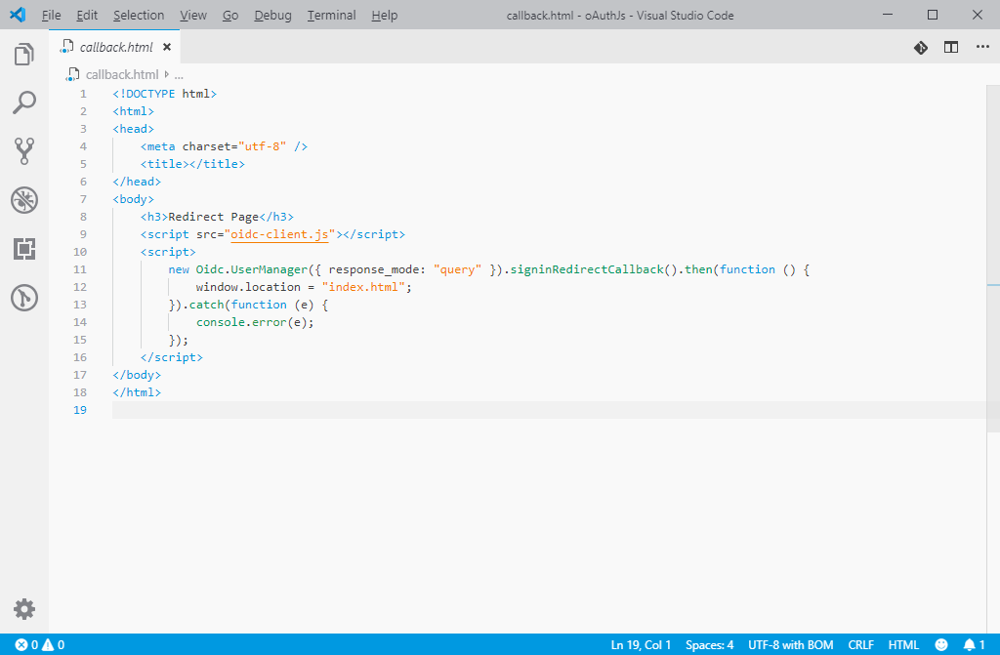
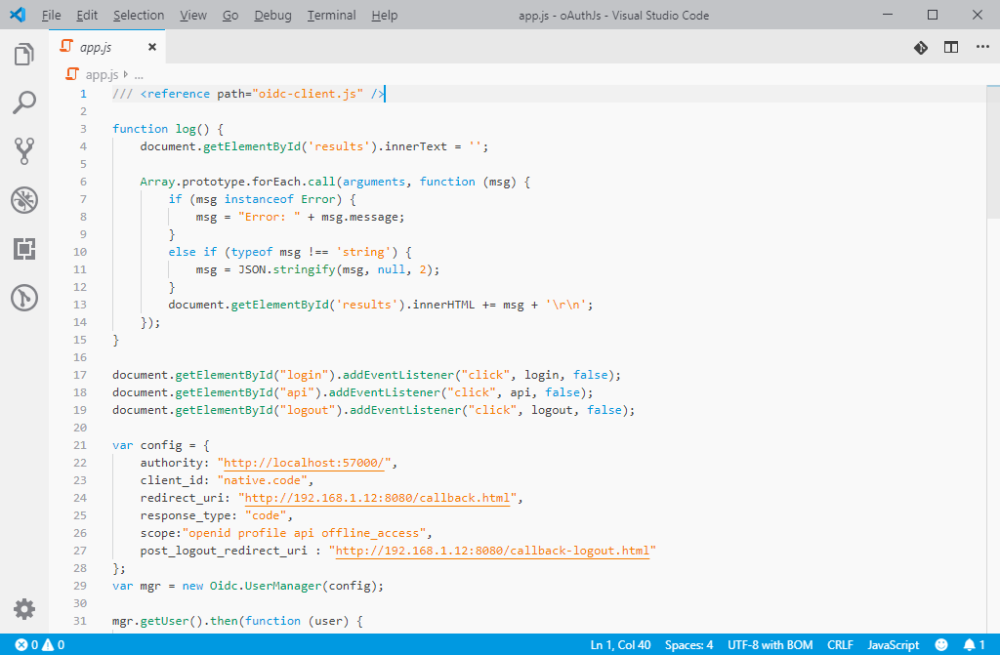

# OC7 Light
This extension for Visual Studio Code adds light theme titled "OC7 Light".

## Installation

Copy it into the `<user home>/.vscode/extensions` folder and restart Code.

## Screenshots

